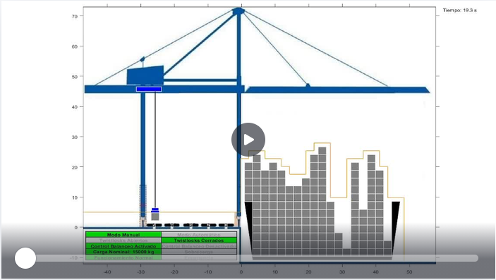
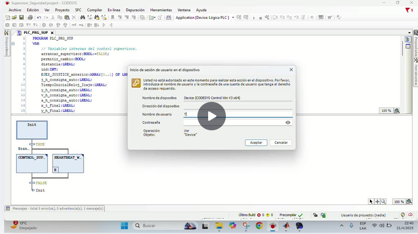
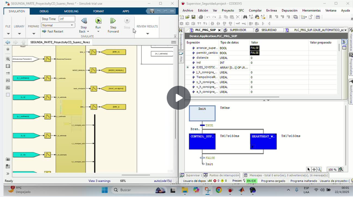

# Control Semi-Automático Coordinado de Grúa Portuaria de Muelle Tipo Pórtico

Proyecto Final Integrador de la asignatura **Autómatas y Control Discreto**, desarrollado en la carrera de **Ingeniería Mecatrónica — Universidad Nacional de Cuyo (UNCuyo)**.

El proyecto implementa el control semi-automático de una grúa portuaria de contenedores tipo pórtico, abordando el problema desde un enfoque de **tres niveles de control jerárquico**: seguridad, supervisor y regulador.

## Descripción General

El objetivo principal es diseñar e implementar un sistema de control que permita el movimiento coordinado de una grúa, asegurando un seguimiento preciso de consignas y una amortiguación efectiva del balanceo de la carga. El proyecto se divide en dos etapas metodológicas:

1.  **Model-in-the-Loop (MIL):** Desarrollo y validación de todos los sistemas en **Simulink/Stateflow**.
2.  **Software-in-the-Loop (SIL):** Implementación de los niveles de control en **CODESYS** (PLC virtual) y su integración con Simulink mediante una arquitectura **Cliente/Servidor OPC UA**.

## Arquitectura de Control

El sistema se compone de tres niveles jerárquicos:

*   **Nivel 0 - Control de Seguridad:** Implementado como una máquina de estados finitos (FSM). Gestiona emergencias (watchdog, parada de emergencia, límites operativos) y lleva el sistema a un estado seguro.
*   **Nivel 1 - Control Supervisor:** Implementado como una FSM. Se encarga de la generación de trayectorias (manuales y automáticas), la estimación de carga, el manejo de frenos de operación y la lógica de modo de operación (manual/automático).
*   **Nivel 2 - Control Regulador:** Implementado en tiempo discreto. Utiliza una ley de control **Feedforward No Lineal con Feedback PD** para el control de posición del carro y el izaje, junto con un lazo de amortiguación activa para reducir el ángulo de balanceo de la carga.

## Tecnologías y Herramientas Utilizadas

*   **MATLAB/Simulink:** Modelado de la planta, desarrollo del control regulador, simulación y visualización.
*   **Stateflow:** Diseño de las máquinas de estado finitos para los niveles de seguridad y supervisor.
*   **CODESYS:** Implementación de los niveles 0 y 1 en lenguaje IEC 61131-3 (SFC y ST) sobre un PLC virtual.
*   **OPC UA:** Protocolo de comunicación industrial para la integración entre CODESYS y Simulink en la etapa SIL.
*   **MATLAB Function (Simulink):** Implementación del control regulador en tiempo discreto, análogo a un bloque de función de PLC.

## Demo

A continuación, se presentan algunos videos que demuestran el funcionamiento del sistema en sus diferentes etapas.

*   **Simulación Completa (MIL):**
    *   *Descripción:* Muestra la grúa realizando una maniobra completa, incluyendo la generación de trayectorias, el control de balanceo y la lógica de los autómatas.

    

*   **Simulación Sistema Seguridad (MIL):**
    *   *Descripción:* Muestra el accionar del sistema de seguridad al detectar una sobrecarga. Posteriormente detecta limites operativos.

    

*   **Integración CODESYS-Simulink (SIL):**
    *   *Descripción:* Demuestra la comunicación en tiempo real entre el PLC virtual (CODESYS) y la planta simulada (Simulink) a través de OPC UA.

    

*   **Integración CODESYS-Simulink, Sistema de Seguridad (SIL):**
    *   *Descripción:* Demuestra la comunicación en tiempo real entre el PLC virtual de seguridad (CODESYS) y la planta simulada (Simulink) a través de OPC UA.

    

## Documentación

La documentación completa del proyecto se encuentra disponible en:

**[Informe del proyecto](informe/ProyectoAyCD.pdf)**

El informe contiene la descripción del sistema, desarrollo matemático de la simulación, arquitectura de los módulos, implementación en Simulink-CODESYS y conclusiones.

> **Nota:** El código fuente no se incluye actualmente en este repositorio. Este repositorio tiene como objetivo documentar y mostrar el resultado del proyecto mediante videos y el informe técnico.

## Autores

**Tomás Mauricio Suárez - Rodrigo Pérez**

Ingeniería Mecatrónica — Universidad Nacional de Cuyo
Mendoza, Argentina — 2025
